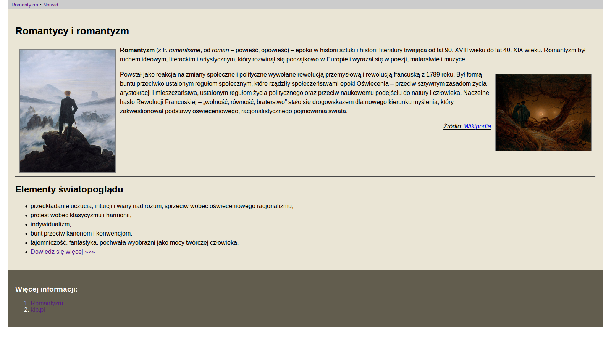
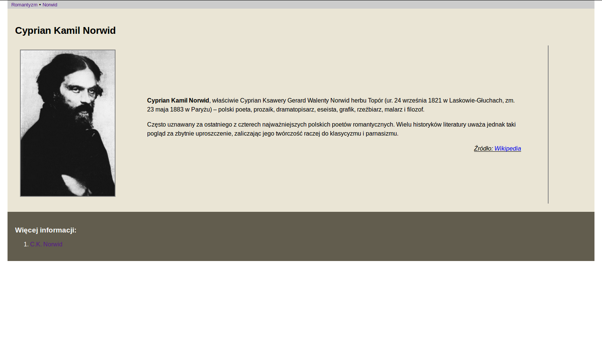

# HTML&CSS – ćwiczenie 1

## Zadanie 1

W pliku *index.html* należy przygotować stronę HTML, która będzie wyglądała jak
na zrzucie poniżej:

Kliknij, aby zobaczyć [większy obrazek](img/index.png).

Repozytorium zawiera:

* plik *index.html* – szkielet strony HTML, tu wprowadzaj wszystkie zmiany;
* plik *css/style.css* – podstawowy arkusz stylów CSS, tu dodawaj/modyfikuj definicje stylów;
* katalog *img* – tu wgrywaj potrzebne obrazki, tu znajdziesz też obrazek potrzebny do zadania 2.

### Polecenia

W pliku *index.html*:

1. Wstaw taki sam tytuł strony i nagłówka pierwszego stopnia.
1. Wstaw dwa odnośniki w menu.
1. Wstaw dwa akapity, a w każdym obrazki wyrównane do właściwej strony – obrazki i treść pobierz ze strony [Romantyzm](https://pl.wikipedia.org/wiki/Romantyzm).
1. Wstaw akapit z tekstem "Źródło" i odnośnikiem do Wikipedii.
1. Wstaw poziomą linię.
1. Wstaw nagłówek stopnia drugiego.
1. Wstaw listę wypunktowaną.
1. Na końcu listy umieść odnośnik do konkretnej strony w Internecie.
1. W stopce wstaw znacznik nagłówka trzeciego poziomu.
1. Wstaw listę wypunktowaną zawierającą dwa odnośniki do stron w Internecie.
1. Dołącz do dokumentu arkusz stylów CSS *style.css*.
1. W pliku *style.css* umieść:
  * definicję ustawiającą marginesy zewnętrzne strony (poza marginesem górnym) na 20px
  * definicję powiększającą czcionkę nagłówka stopnia pierwszego do 26px
  * definicje zmieniające kolor tła (wybierz) i wewnętrzne marginesy elementu `<section>` na 20px
  * definicje zmieniające kolor tła (wybierz), kolor czcionki (wybierz) i wewnętrzne marginesy elementu `footer` na 20px
  * klasę `.obrazek` definiującą szerokość (250px), obramowanie (2px, grey) i marginesy zewnętrzne obrazków (10px)
  * klasy `.nalewo`, `.naprawo` pozwalające wyrównywać elementy do lewej i prawej strony
  * klasę `.zrodlo` podkreślającą tekst, pochylającą czcionkę i wyrównującą tekst akapitu "Źródło" do prawej  strony

1. Przypisz odpowiednim elementom zdefiniowane klasy CSS.

Wykonanie poszczególnych punktów zatwierdzaj w kolejnych migawkach z komentarzem w formacie *1.1, 1.2, 1.3, itd.*

## Zadanie 2

W pliku *norwid.html* należy przygotować stronę HTML, która wygląda podobnie do poniższej:

Kliknij, aby zobaczyć [większy obrazek](img/norwid.png).

### Polecenia

Plik *norwid.html* utwórz na podstawie pliku *index.html*. Następnie:

1. Upewnij się, że działają odnośniki w menu.
1. Zmień tytuł dokumentu i zawartość nagłówka strony.
1. Z elementu `<section>` usuń wszystko poza nagłówkiem.
1. Wstaw 2-komórkową tabelę, szerokość lewej komórki ustaw 10%.
1. W lewej komórce umieść obrazek, w prawej akapity z tekstem pobranym z odpowiedniej strony Wikipedii oraz akapit "Źródło".
1. Zmień treść i url odnośnika w stopce strony.
1. Za pomocą stylów CSS ustaw prawy margines tabeli na 100px.
1. Utwórz klasę CSS ``.tdright``, która definiuje 5% wewnętrzne marginesy oraz prawe obramowanie (2px, grey).
1. Zastosuj utworzoną klasę.

Uwaga:

    Wykonanie poszczególnych punktów zatwierdzaj w kolejnych migawkach z komentarzem w formacie *2.1, 2.2, 2.3, itd.*

## Materiały

1. [Elementy HTML](http://webkod.pl/dodatki/html/mapa-html-elementy-atrybuty-wartosci>)
2. [HTML Element Reference](http://www.w3schools.com/tags/default.asp)
3. [Właściwości CSS](http://webkod.pl/kurs-css/wlasciwosci/tekst/text-align)
4. [CSS Reference](http://www.w3schools.com/cssref/default.asp)
